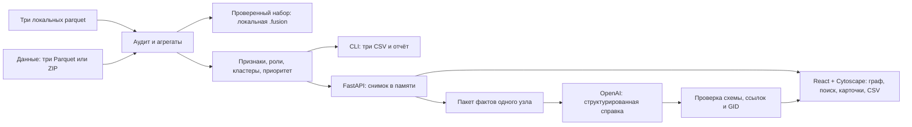

# Fusion — кого проверить первым?

Fusion помогает AML-аналитику банка разобраться в сети денежных переводов: от списка исходных клиентов перейти к приоритетным участникам, их связям и объяснимым гипотезам о роли. Вместо ручного обхода тысяч переводов аналитик получает направленный граф, топ-20, карточку любого участника и три готовые CSV-выгрузки.

**Что работает:** локальный аудит, загрузка другого набора через «Данные», шесть ролей с формальными правилами, поиск по ID, фильтрация графа и AI-справка OpenAI со ссылками на факты. На исходном наборе — все 2 248 узлов и 88 кластеров. Роли и приоритеты вычисляются Python; модель только объясняет результат. Граф и CSV воспроизводятся без AI-ключей и интернета после установки зависимостей.

**Стек:** Python 3.12 · FastAPI · pandas / PyArrow · NetworkX / SciPy · React / TypeScript · Vite · Cytoscape.js. AI: серверный OpenAI Responses API, `gpt-5.4-mini`, reasoning low. База данных, Docker, GPU и обучение модели не требуются.

**Готовность: READY — FREEZE CORE.** Закрыты замечания [аудита](docs/TECHNICAL_AUDIT.md): в интерфейсе видны полные входящие/исходящие связи с суммами, пять вкладов приоритета, место среди всех участников и ограничения наблюдения. Сводка кластера показывает размер, seed, внутренний оборот и лидеров. Формулы и три CSV сохранены. Проверки — [PROGRESS.md](docs/PROGRESS.md).

## Быстрый запуск на новой машине

Нужны Python 3.12, Node.js 22 и Git. Команды ниже проверены на macOS; выполнять из корня проекта.

**1. Получить код и установить зависимости.**

```bash
git clone https://github.com/BAITC-Hacks/hack-6480017d-fusion.git Fusion
cd Fusion
python3.12 -m venv .venv
.venv/bin/python -m pip install -r backend/requirements-dev.txt
npm --prefix frontend ci
```

**2. Положить три исходных файла организаторов непосредственно в `data/`:**

```text
Fusion/
  data/
    nodes.parquet
    edges.parquet
    transactions.parquet
```

Датасет предоставлен для хакатона. Если после клонирования этих файлов нет, скопируйте их из выданного архива. Не изменять исходные файлы и не удалять повторяющиеся транзакции. Схема данных — [docs/dataset.md](docs/dataset.md).

**3. Рассчитать результаты и запустить приложение.**

```bash
.venv/bin/python -m backend.pipeline
.venv/bin/python scripts/run_local.py
```

Открыть **[Fusion — http://127.0.0.1:5173](http://127.0.0.1:5173)**. Запускатель поднимает backend и frontend, проверяет их соединение и оставляет их работать до `Ctrl+C`. Он не останавливает чужие процессы и не запускает второй сервер на занятом порте. Если Fusion уже работает, проверить его одной командой без изменения процессов:

```bash
.venv/bin/python scripts/run_local.py --check
```

Для основного расчёта и интерфейса `.env` не нужен. Настройка AI-справки — ниже. Зависимости закреплены в `backend/requirements.txt` и `frontend/package-lock.json`; `requirements-dev.txt` добавляет инструменты тестирования.

## Как проверить результат за три минуты

Числа ниже относятся к исходному набору организаторов. Если загружали другой набор, сначала откройте «Данные» → «Вернуть исходные данные».

1. В сводке должны быть **2 248 участников, 3 119 связей, 4 840 транзакций и 81 seed** за июль 2026 года. Слева — топ-20 по приоритету проверки.
2. Открыть #5 — `100000004015047100`: consolidator, приоритет **0,625090**, место **5 из 2248**. В «Почему такой приоритет» видны пять слагаемых; в блоке «Потоки» справа — **9 плательщиков / 1 получатель**, **919 104 / 69 195 KZT**, полный ID контрагента и число переводов. Нажать ID, чтобы перейти к его карточке. Запасной пример транзита — `100000003635170100`: 3/4 контрагента, 268 500/253 500 KZT.
3. Найти `100000008175078100`: **граница depth=4**, видны **0,406146 × 0,5 = 0,203073** и объяснение понижения. Это политика модели, не доказательство низкой важности. Изолированный seed `100000000456947100` доступен через поиск: нулевой приоритет и честное пустое состояние потоков.
4. В списке над графом выбрать кластер 0: **278 участников, 1 seed, 31 237 334,24 KZT** внутри группы. Раскрыть «Гипотеза и лидеры» справа, переключить окраску графа и скачать три файла через «Экспорт CSV» в верхней панели. Основное демо работает без LLM; OpenAI — необязательная справка со ссылками на факты.

Подробный сценарий выступления и шесть примеров — [docs/DEMO.md](docs/DEMO.md).

**Полный воспроизводимый расчёт — одна команда:**

```bash
.venv/bin/python -m backend.pipeline
```

Она проверяет входные данные, рассчитывает результаты и создаёт файлы в `artifacts/`:

| Файл | Что проверять |
|---|---|
| `nodes_roles.csv` | 2 248 строк; `gid, role, role_score, cluster_id, priority_score, evidence` |
| `clusters.csv` | 88 строк; `cluster_id, n_nodes, n_seed, sum_kzt_internal, top_gids, hypothesis` |
| `top_nodes.csv` | Не менее 20 строк; `rank, gid, role, priority_score, why` |
| `run_report.json` | Время расчёта, параметры, количество строк и SHA-256 входных и выходных файлов |

Можно задать `--data data --out artifacts --top 20`. На предоставленном объёме полный расчёт укладывается в требуемые пять минут; время конкретного запуска записывается в `run_report.json`. Для одинакового входного набора API-выгрузки побайтно совпадают с результатами CLI. CLI по умолчанию читает `data/`, а API выдаёт текущий выбранный набор. Локальные результаты не добавляются в Git и воспроизводятся командой выше.

## Загрузка другого датасета

В верхней панели нажмите **«Данные»**, выберите **три файла** `nodes.parquet`, `edges.parquet`, `transactions.parquet` либо **один ZIP** и нажмите **«Проверить и загрузить»**. ZIP может содержать вложенные папки, но в нём нужен ровно один Parquet каждого указанного имени. Документы, starter-скрипты и служебные файлы macOS игнорируются: сервер извлекает только три таблицы и ничего из архива не исполняет. CSV и Excel не поддерживаются.

Требуется точная схема Parquet, без дополнительных колонок и пропусков:

| Файл | Колонки и типы |
|---|---|
| `nodes.parquet` | `gid: int64`, `depth: int64`, `is_seed: bool` |
| `edges.parquet` | `src: int64`, `dst: int64`, `sum_kzt: float64`, `n_tx: int64`, `depth: int8` |
| `transactions.parquet` | `src: int64`, `dst: int64`, `date: date32`, `sum_kzt: float64` |

Проверяются уникальность узлов и направленных пар, наличие всех ID в `nodes`, положительные суммы, совпадение сумм и количества транзакций с каждым агрегатом, seed и кратчайшие расстояния от них. Сохраняется модель кейса: глубина узлов 0–4, рёбер 1–4, отсутствие наблюдаемых исходящих на depth=4, транзакции от 5 000 KZT. **Период загруженного набора может быть любым** и определяется по датам транзакций. Команда `backend.audit` по-прежнему проверяет исходные данные с ограничением на июль 2026; загрузка через интерфейс снимает только это ограничение периода.

Лимиты: **50 МиБ** суммарно на три файла или ZIP, **200 МиБ** после распаковки и по несжатым метаданным Parquet, до **10 000 узлов / 100 000 связей / 200 000 транзакций**. В ZIP допускается до 1000 записей; дубликаты, небезопасные пути, символические ссылки и шифрование отклоняются. Метаданные и лимиты проверяются до полного чтения и расчёта.

Пока идёт проверка, действует прежний набор. После успеха граф, карточки, сводка и скачиваемые через API CSV переключаются на новый снимок; старые AI-задачи и кеш сбрасываются. При ошибке прежний набор сохраняется. **«Вернуть исходные данные»** повторно проверяет и активирует `data/`.

Активный набор **общий для всех вкладок этого локального сервера**; интерфейс обновляет его при возвращении во вкладку и периодически проверяет изменения. Используйте один процесс backend. Выбор сохраняется между запусками в `.fusion/active_dataset.json`, файлы — в `.fusion/datasets/<id>/`. Это локальное хранилище исключено из Git через `.gitignore`. Загрузка и возврат не переписывают исходную `data/` и результаты CLI в `artifacts/`. Перезапуск для загрузки через интерфейс не требуется. Числа нового набора смотрите в окне «Данные» и сводке, а актуальные результаты скачивайте через «Экспорт CSV».

## Методика и ограничения

Шесть ролей: `consolidator`, `transit`, `distributor`, `terminal`, `coordinator`, `peripheral`. Правила используют число контрагентов, наблюдаемые входящие/исходящие суммы, out/in, достижимость от seed и PageRank. Порядок правил, пороги, формулы скоров и кластеризация описаны в [docs/METHODOLOGY.md](docs/METHODOLOGY.md); `rule_id`, признаки и вклады приоритета доступны в CSV. Кластеризация использует взвешенную неориентированную проекцию с фиксированным seed; метрики и визуализация сохраняют направление.

- Все **19 изолированных seed** сохранены. Все **444 узла границы depth=4** имеют флаг неполноты наблюдения и не объявляются конечными получателями из-за отсутствия исходящих.
- Известны только внутрибанковские переводы от **5 000 KZT**, собранные исходящим обходом до четырёх колен. Период исходного набора — июль 2026 года; у загруженного он может отличаться. Вход seed неполон; out/in не является полным балансом или доказательством транзита.
- Роль `terminal` означает наблюдаемого кандидата в конечные получатели, а `coordinator` — структурную гипотезу. Это не доказательство удержания денег или организаторства.
- Эталонной разметки нет. Роли и скоры — эвристики для проверки аналитиком, не вероятность виновности и не измеренная точность.
- ID сохраняются точно: int64 в parquet/Python, строки в JSON/TypeScript/Cytoscape. В Excel импортировать колонку `gid` как **текст**, чтобы не потерять цифры.

Рабочий экран: Top-20 слева (либо все узлы, если их меньше 20), граф по центру, карточка участника справа. Поиск GID, кнопка «Данные» и меню «Экспорт CSV» находятся в верхней панели. Боковые панели прокручиваются отдельно; на узком экране блоки идут друг под другом. Потоки сразу открыты, а подробные признаки, основания роли и ограничения раскрываются в карточке. AI-разбор открывается в отдельном окне с собственной прокруткой.

Граф показывает до 250 узлов выбранного окружения или кластера с явными счётчиками полного и показанного объёма. **Таблица потоков выбранного gid всегда полная и не ограничена графом**; переключатель показывает входящие/исходящие пары, суммы KZT до двух знаков и n_tx. Таблица имеет собственную прокрутку; на desktop карточка также ограничена по высоте. Поиск доступен по всем участникам, CSV всегда полные. Размер узла отражает приоритет, ромб — границу наблюдения, двойной контур — seed. Карточки, граф и CSV используют единый снимок расчёта в памяти. Для переключения используйте «Данные»; ручная замена файлов сама по себе не обновляет уже работающий снимок.

Пять показанных вкладов уже умножены на веса; их сумма до округления — `priority_base`, затем применяется `priority_factor`. Карточка показывает полный ранг и отдельное обоснование позиции. Priority — аналитический приоритет, а «выраженность признаков роли» — поддержка выбранного правила; оба значения не являются вероятностью. Статусы наблюдаемости: «Не обрезан на depth=4», «Граница depth=4», «Нет наблюдаемых связей». Первый статус не обещает полного баланса; для seed отдельно отмечен неполный вход. Betweenness и HITS в текущую формулу не добавлялись.

## AI-справка OpenAI

Если `backend/.env` ещё нет, создайте его из `backend/.env.example`, не перезаписывая существующий файл. Настройте только серверный файл:

```dotenv
OPENAI_API_KEY=
OPENAI_MODEL=gpt-5.4-mini
NVIDIA_ENABLED=false
```

Добавьте ключ после `OPENAI_API_KEY=` и перезапустите backend. Реальный `backend/.env` исключён из Git; ключи остаются только на локальном сервере. В репозитории есть безопасный шаблон `backend/.env.example`. Значения не приводятся в документации, браузере или журналах. Переменные окружения процесса имеют приоритет над `.env`. Значение `OPENAI_MODEL` можно изменить. Фактические модель и статус настройки доступны через `/api/ai/status`, но наличие настройки само по себе не подтверждает работоспособность API.

Кнопка «AI-разбор» открывает отдельное широкое окно, сохраняя компактную карточку, и передаёт OpenAI ограниченный пакет одного узла: 24 факта, не более 8 направленных связей, источники и ограничения. Модель возвращает гипотезу, основания со ссылками, ограничения и следующие проверки. Backend проверяет схему, ссылки и допустимые GID; корректный JSON сам по себе не доказывает истинность текста. Роли, скоры и CSV не меняются.

На новый разбор без кеша — **один запрос OpenAI**, без скрытых повторов. Повторные клики присоединяются к выполняющемуся разбору, одновременно допускаются два разных разбора. Ожидание ограничено серверным таймаутом; текущее значение видно в `/api/ai/status`. Валидные ответы кешируются в памяти на час с учётом данных, правил, пакета, промпта и модели; перезапуск очищает кеш. Явное обновление делает новый запрос. Интерфейс различает ответ API, кеш и ошибку, показывает фактическую модель, задержку и сообщённое провайдером число токенов.

При ошибке OpenAI показывается **локальная справка (fallback)**, которая не считается ответом модели. Базовая аналитика продолжает работать. NVIDIA отключена по умолчанию и не вызывается; необязательную рецензию можно явно включить через `NVIDIA_ENABLED=true` с отдельным действительным ключом. Она не требуется для текущего демо. Подробности интеграции — [AI_DESIGN.md](docs/AI_DESIGN.md).

Реальная проверка: **6/6 успешных ответов OpenAI** на разных примерах, включая границу и изолированный seed; задержка последнего прогона **3.83–7.70 с**. Проведена ручная сверка; интерпретации остаются гипотезами. Результаты и ограничения реальных проверок — [AI_VALIDATION.md](docs/AI_VALIDATION.md).

## Автоматические и реальные проверки

```bash
.venv/bin/python -m backend.audit
.venv/bin/python -m unittest discover -s backend/tests -v
.venv/bin/python -m pip check
npm --prefix frontend run build
```

Аудит полностью читает три parquet и выполняет **34 проверки** схем, ссылок, глубин, дат, изолятов и агрегатов каждой пары. Он обновляет [DATA_AUDIT.md](docs/DATA_AUDIT.md), не меняя исходные данные; провал проверки возвращает ненулевой код. Подтверждённый полный прогон после добавления загрузки — **99/99 backend-тестов**. Помимо расчётов и AI проверены загрузка, другой период, сохранение прежнего снимка при ошибках, лимиты, безопасный ZIP, возврат, восстановление после запуска и очистка AI-состояния. Тестовые приложения используют отдельные хранилища и не меняют активный набор пользователя. Актуальный статус сборки и проверки интерфейса — [PROGRESS.md](docs/PROGRESS.md).

Для реальных вызовов при запущенном backend и настроенном ключе:

```bash
.venv/bin/python -m backend.validate_ai --limit 1
.venv/bin/python -m backend.validate_ai --limit 6
```

Эти команды **обходят кеш и расходуют API-баланс**. Первая проверяет один пример, вторая — шесть разных случаев, включая depth=4 и изолированный seed. NVIDIA при выключенном флаге не вызывается. Реальные ответы сохраняются без ключей в `artifacts/ai_validation.json`. Модуль останавливается при ошибке. После технической проверки нужна ручная оценка фактов, оговорок и русского языка; тесты адаптеров не заменяют реальные ответы.

## Архитектура



`backend/` — аудит, расчёт, API и AI; `frontend/` — интерфейс; `data/` — исходные входные файлы; `.fusion/` — загруженные наборы и текущий выбор; `artifacts/` — воспроизводимые результаты CLI; `docs/` — кейс, методика, проверки и демо. `starter/` — неизменённый пример организаторов, не готовый результат Fusion. Браузер обращается к локальному Vite proxy `/api`; ключи и обращения к модели остаются на сервере.

Сервисы слушают только `127.0.0.1`, backend — порт 8000, frontend — 5173. Документация API: [http://127.0.0.1:8000/docs](http://127.0.0.1:8000/docs).

| Запрос | Результат |
|---|---|
| `GET /api/health` | Доступность процесса; готовность данных проверяется отдельно |
| `GET /api/datasets/current` | Текущий набор: `id`, `name`, `is_default`, `nodes`, `edges`, `transactions`, `period`, `loaded_at` |
| `POST /api/datasets` | Multipart с повторяемым полем `files`: три Parquet либо один ZIP; проверка, расчёт и переключение |
| `POST /api/datasets/reset` | Возврат к исходному набору `data/` после повторной проверки |
| `GET /api/analysis` | Сводка, топ-20, роли и кластеры |
| `GET /api/nodes/{gid}` | Признаки, полный ранг, пять вкладов и множитель, why, ограничения и полные incoming_edges/outgoing_edges |
| `GET /api/graph?gid={gid}` | Выбранный узел и ближайшие соседи |
| `GET /api/graph?cluster_id={id}` | Участники и связи кластера |
| `GET /api/exports/{filename}` | Одна из трёх полных CSV-выгрузок |
| `GET /api/ai/status` | Публичная конфигурация AI без ключей |
| `POST /api/ai/analyses` | Запуск разбора: JSON `{"gid":"100000003635170100","refresh":false}` |
| `GET /api/ai/analyses/{job_id}` | Состояние, справка и пакет фактов |

Граф принимает один фильтр — `gid` или `cluster_id` — и `limit` от 1 до 500. Неизвестный объект возвращает 404, некорректный параметр — 422, недоступные данные — 503. Одновременно разрешены два AI-разбора, превышение лимита — 429.

Загрузка и возврат возвращают 200 и те же поля, что `/api/datasets/current`. Ошибки загрузки: 422 — формат или проверка данных, 413 — превышение лимита, 409 — другое переключение уже выполняется; `detail` содержит пояснение по-русски. Запросы изменения набора с посторонним браузерным `Origin` отклоняются с 403; разрешены локальные порты 5173, 4173 и 8000.

Альтернативный запуск в двух терминалах:

```bash
.venv/bin/python -m uvicorn backend.app:app --host 127.0.0.1 --port 8000
```

```bash
npm --prefix frontend run dev
```

## Масштабирование

Для графа около миллиона узлов потребуются пакетная агрегация Arrow/Polars, компактный графовый движок, приближённые центральности и выдача только выбранного окружения в интерфейс. AI по-прежнему получает небольшой пакет одного узла. Это план развития: текущий NetworkX-пайплайн на миллионе узлов не проверен.

## Материалы

- [Исходный кейс](docs/case.md) · [схема данных](docs/dataset.md) · [методика и пороги](docs/METHODOLOGY.md).
- [Демо на три минуты](docs/DEMO.md) · [проверка AI](docs/AI_VALIDATION.md) · [текущий статус](docs/PROGRESS.md).
- [Запуск и локальные настройки](docs/LOCAL_SETUP.md) · [совместная работа](docs/COLLABORATION.md).
