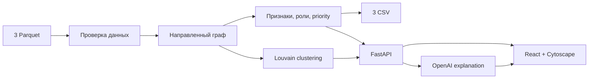

# Fusion — кого проверить первым?

Fusion — аналитический инструмент для AML-аналитика банка. Он превращает транзакционную сеть в приоритизированную очередь проверки и отвечает на главный вопрос:

> **Кого из клиентов проверять первым и почему?**

На исходном наборе Fusion анализирует **2 248 участников**, строит направленный граф переводов, определяет роли, кластеры и Top-20 по приоритету. Основные расчёты выполняются локально и не зависят от LLM.

---

## 1. Что решает продукт

AML-аналитик получает список уже известных клиентов и должен вручную восстановить, куда идут деньги, где они концентрируются, через какие узлы проходят и кого проверять дальше.

Fusion автоматизирует этот этап.

Система:

- строит направленный граф денежных переводов;
- выделяет структурные роли участников;
- группирует сеть по кластерам;
- формирует **Top-20 узлов для первичной проверки**;
- показывает входящие и исходящие связи, суммы и количество операций;
- объясняет, **из каких факторов сформирован priority score**;
- показывает ограничения наблюдаемости данных.

Для выбранного GID аналитик видит:

- роль;
- место в общем рейтинге;
- priority score;
- входящие и исходящие денежные потоки;
- кластер;
- объяснение роли и приоритета;
- ограничения данных.

### Бизнес-результат

Fusion сокращает время на:

- ручную трассировку цепочек переводов;
- поиск точек консолидации;
- поиск транзитных и распределяющих узлов;
- поиск структурно значимых участников;
- первичную приоритизацию AML-проверки.

Система **не принимает решение о виновности клиента и не заменяет AML-аналитика**.

Fusion формирует аналитическую гипотезу и показывает, куда смотреть в первую очередь. Решение об углублённой проверке и дальнейших действиях остаётся за AML-аналитиком.

---

## 2. Как запустить

Требования:

- Python 3.12
- Node.js 22
- Git

Команды выполнять из корня проекта.

### 1. Получить код и установить зависимости

```bash
git clone https://github.com/BAITC-Hacks/hack-6480017d-fusion.git Fusion
cd Fusion

python3.12 -m venv .venv
.venv/bin/python -m pip install -r backend/requirements-dev.txt
npm --prefix frontend ci
```

### 2. Положить исходные данные в `data/`

```text
data/
├── nodes.parquet
├── edges.parquet
└── transactions.parquet
```

### 3. Рассчитать результаты и запустить приложение
# macOS / Linux
source .venv/bin/activate

# Windows PowerShell
.venv\Scripts\Activate.ps1

:: Windows CMD
.venv\Scripts\activate.bat

```bash

.venv/bin/python -m backend.pipeline
.venv/bin/python scripts/run_local.py
```

Открыть:

**http://127.0.0.1:5173**

Проверка уже запущенного приложения:

```bash
.venv/bin/python scripts/run_local.py --check
```

Для основного расчёта и интерфейса OpenAI-ключ не требуется.

Если хотите проверить Fusion на другом наборе данных, в интерфейсе нажмите **«Данные»** и загрузите либо **3 файла Parquet** (`nodes.parquet`, `edges.parquet`, `transactions.parquet`), либо **один ZIP-архив**, содержащий эти три файла.

---

## 3. Какие технологии используются



Основной стек:

- **Python 3.12**
- **pandas / PyArrow** — обработка parquet
- **NetworkX / SciPy** — графовая аналитика
- **FastAPI** — backend
- **React + TypeScript + Vite** — frontend
- **Cytoscape.js** — визуализация графа
- **Louvain** — кластеризация
- **OpenAI Responses API** — дополнительное объяснение рассчитанных фактов

AI не определяет роли и не рассчитывает priority score. Если OpenAI недоступен, основной pipeline, интерфейс и CSV продолжают работать.

Структура проекта:

```text
backend/     — расчёты, API, AI
frontend/    — интерфейс и граф
data/        — исходные parquet
artifacts/   — результаты расчёта
docs/        — методика, аудит и demo
```

---

## 4. Как проверить решение

### Шаг 1. Запустить полный расчёт

```bash
.venv/bin/python -m backend.pipeline
```

После запуска должны появиться:

```text
artifacts/nodes_roles.csv
artifacts/clusters.csv
artifacts/top_nodes.csv
artifacts/run_report.json
```

Ожидаемый результат на исходном наборе:

- `nodes_roles.csv` — **2 248 строк**;
- `clusters.csv` — **88 кластеров**;
- `top_nodes.csv` — **не менее 20 узлов**;
- обязательные поля заполнены;
- расчёт укладывается в лимит 5 минут.

### Шаг 2. Запустить автоматические проверки

```bash
.venv/bin/python -m backend.audit
.venv/bin/python -m unittest discover -s backend/tests -v
.venv/bin/python -m pip check
npm --prefix frontend run build
```

Актуальный подтверждённый прогон:

- **34 проверки данных**;
- **99/99 backend-тестов**;
- frontend production build — успешен.

### Шаг 3. Проверить интерфейс за 3 минуты

В сводке должно быть:

- **2 248 участников**;
- **3 119 связей**;
- **4 840 транзакций**;
- **81 seed**;
- Top-20 по приоритету проверки.

Проверочный GID:

```text
100000004015047100
```

Ожидается:

- роль: `consolidator`;
- priority: `0.625090`;
- место: `5 из 2248`;
- 9 плательщиков / 1 получатель;
- 919 104 / 69 195 KZT;
- видны пять составляющих priority;
- видны полные входящие и исходящие связи.

Проверка границы данных:

```text
100000008175078100
```

Должен отображаться статус `depth=4` и понижающий множитель наблюдаемости.

Проверка изолированного seed:

```text
100000000456947100
```

Должен отображаться нулевой приоритет и отсутствие наблюдаемых потоков без ошибочной классификации как terminal.

Проверка кластера:

- выбрать **Cluster 0**;
- ожидается **278 участников**;
- **1 seed**;
- внутренний оборот **31 237 334,24 KZT**;
- доступны лидеры и гипотеза кластера.

### Главный критерий проверки

После выбора любого GID должно быть понятно:

> **Почему этот участник получил такую роль и почему AML-аналитику предлагается проверить его с таким приоритетом?**

---

## Документация

- `docs/METHODOLOGY.md` — правила ролей и priority;
- `docs/DATA_AUDIT.md` — аудит данных;
- `docs/DEMO.md` — сценарий демонстрации;
- `docs/PROGRESS.md` — текущий статус проекта.
