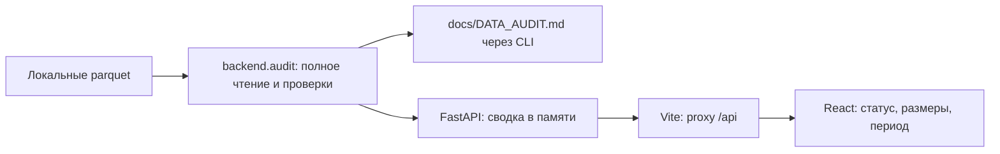

# Fusion

Локальный инструмент для анализа сети денежных переводов. **Этапы 1–2 реализованы:** аудит, FastAPI и экран сводки; отдельно — воспроизводимый расчёт ролей, кластеров, приоритетов и трёх CSV. Интерактивный граф и AI-разбор ещё не реализованы. На текущей странице по-прежнему отображается только сводка первого этапа.

**OpenAI и NVIDIA обязательны на последующем AI-этапе** после работающего расчёта и интерфейса: OpenAI составляет структурированную справку, NVIDIA NIM рецензирует её по тем же фактам. Модели не меняют детерминированные роли, скоры, кластеры и CSV. Сейчас API не подключены, ключи не нужны. Контракт — [docs/AI_DESIGN.md](docs/AI_DESIGN.md).

## Окружение и установка

Все команды — **из корня проекта**. Проверено на macOS arm64: Python 3.12.14, Node 22.13.1, npm 10.9.2, Git 2.50.1. Системный Python 3.14 также доступен; `.venv` создана явно на Python 3.12. Глобальные пакеты не менялись.

Окружение в текущей папке уже установлено. Для воспроизведения на новой машине:

```bash
python3.12 -m venv .venv
.venv/bin/python -m pip install -r backend/requirements-dev.txt
npm --prefix frontend ci
```

Для запуска без тестов достаточно `backend/requirements.txt`. Прямые зависимости — `backend/requirements.in`, runtime с транзитивными версиями — `backend/requirements.txt`, TestClient — `requirements-dev.txt`. React, TypeScript, Vite и Cytoscape.js закреплены в `frontend/package.json` и `package-lock.json`. Vite 6 совместим с установленным Node 22.13.1.

Три предоставленных файла `nodes.parquet`, `edges.parquet`, `transactions.parquet` находятся в `data/`. После установки зависимостей текущий этап работает без интернета. `.venv`, node_modules, parquet и реальные `.env` исключены из Git. Серверный `backend/.env.example` содержит пустые ключи/модели и публичный адрес NVIDIA; каркас пока не загружает этот шаблон. Реальный `.env` не требуется для запуска, не читается и не перезаписывается при обновлении плана.

## Расчёт ролей и выгрузок — этап 2

Из корня проекта одной командой, без ключей и сети:

```bash
.venv/bin/python -m backend.pipeline
```

Результаты в `artifacts/`: `nodes_roles.csv`, `clusters.csv`, `top_nodes.csv`, `run_report.json`. Можно задать `--data data --out artifacts --top 20`. На предоставленных данных: **2248 узлов, 88 кластеров, топ-20**. Распределение гипотез: consolidator 95, coordinator 18, distributor 61, transit 67, terminal 1034, peripheral 973. Это результат правил, не истинная разметка.

Все 19 изолированных узлов сохранены; все 444 узла обрезанной границы имеют явный флаг неполноты наблюдения. Роль terminal на остальных узлах означает только наблюдаемого кандидата в конечные получатели за данный период, а не доказательство отсутствия дальнейшего движения денег.

Полная [методика](docs/METHODOLOGY.md) содержит порядок правил, пороги, формулы обоих скоров и условия кластеризации. `rule_id`, признаки и вклады приоритета сохранены в CSV. Идентификаторы в CSV точные целые; при открытии в Excel импортируйте их как текст. Это локальные результаты, не добавляемые в Git: напарник воспроизводит их командой после копирования данных.

## Запуск

Терминал 1:

```bash
.venv/bin/python -m uvicorn backend.app:app --host 127.0.0.1 --port 8000
```

Терминал 2:

```bash
npm --prefix frontend run dev
```

Откройте **http://127.0.0.1:5173**. Серверы слушают только loopback. Vite проксирует `/api` на `127.0.0.1:8000`, поэтому отдельный CORS не нужен. Порт 5173 фиксирован: если занят уже работающим Fusion, откройте его страницу; для перезапуска остановите свой процесс через `Ctrl+C`. При занятом порте Vite сообщает ошибку, не выбирая другой незаметно.

Проверка API:

```bash
curl --fail http://127.0.0.1:8000/api/health
curl --fail http://127.0.0.1:8000/api/summary
curl --fail http://127.0.0.1:5173/api/summary
```

`health` возвращает `{"status":"ok","service":"Fusion"}` и означает доступность процесса. `summary` возвращает `nodes`, `edges`, `transactions`, `seed_nodes` и `period: {start, end}` с датами YYYY-MM-DD. При ошибке данных summary отвечает HTTP 503; health остаётся доступным. Документация API — http://127.0.0.1:8000/docs.

Данные проверяются при старте backend и хранятся в памяти. После замены parquet нужен перезапуск backend. Кнопка «Обновить» повторяет запрос, а не перечитывает файлы. На странице есть загрузка, ошибка и повтор; таймаут запроса — 10 секунд. Внешних шрифтов, аналитики и API в текущем интерфейсе нет.

## Проверки и сборка

```bash
.venv/bin/python -m backend.audit
.venv/bin/python -m unittest discover -s backend/tests -v
.venv/bin/python -m pip check
npm --prefix frontend run build
```

Аудит полностью читает три parquet, сверяет схемы, пропуски, уникальность, ссылки, глубины, даты, изоляты и агрегаты каждой направленной пары, обновляет `docs/DATA_AUDIT.md`. При провале проверки возвращается ненулевой код. Исходные файлы не меняются; одинаковые транзакции участвуют в расчёте без удаления.

Повторно проверено 23 сентября 2026: **2248 узлов, 3119 рёбер, 4840 транзакций, 81 seed; 2026-07-01 — 2026-07-31**. Первый этап ранее прошёл 34 проверки аудита, 12 тестов и сборку; с расчётным модулем набор расширен до 26 успешно пройденных тестов. Тесты также проверяют сводку на другом наборе данных и HTTP 503 при неверных агрегатах. Полные результаты, противоречия и ограничения — [DATA_AUDIT.md](docs/DATA_AUDIT.md); статус и непроверенные сценарии — [PROGRESS.md](docs/PROGRESS.md).

Для локального preview собранной версии при работающем backend:

```bash
npm --prefix frontend run preview
```

Адрес — http://127.0.0.1:4173, proxy настроен аналогично dev. Отображение реальной сводки проверено в Chrome (dev) и Safari (preview); оба proxy возвращают данные backend.

## Архитектура и точность



`backend/` — аудит, API, сериализация, тесты; `frontend/` — интерфейс; `data/` — входные файлы; `artifacts/` зарезервирован для рассчитанных результатов. `starter/` сохранён без изменений. В нём граф пропускает изоляты, sanity_check сравнивает только пары, а требования не включают SciPy; его запуск не является готовым MVP.

`gid/src/dst` сохраняются int64 в pandas/parquet и точными строками в JSON. `backend.serialization.SafeJSONResponse` рекурсивно обрабатывает эти поля и отклоняет float; он также установлен по умолчанию в FastAPI. Для NumPy-скаляров возвращайте `SafeJSONResponse(payload)` напрямую. В Pydantic используйте `Gid`, в TypeScript — `Gid = string`; для массивов ID и будущих Cytoscape `id/source/target` явно вызывайте `id_to_string`. Не использовать float, JavaScript Number/parseInt или `DataFrame.iterrows()` на пути ID. Есть тест HTTP-ответа с ID выше 2^53 и границами int64.

Выгрузка ограничена внутрибанковскими переводами от 5000 KZT за июль и исходящим обходом до depth=4. Нулевой исходящий поток на границе не доказывает terminal. Входящий поток seed неполон; out/in не является полным балансом или доказательством транзита. Эталонной разметки нет: будущие роли и скоры — эвристические гипотезы, не вероятность виновности и не измеренная точность.

## Выгрузки и следующие этапы

Источник требований — [кейс](docs/case.md), рабочая последовательность — [PLAN.md](docs/PLAN.md). Обязательные итоговые выгрузки:

| Файл | Поля |
|---|---|
| nodes_roles.csv | gid, role, role_score, cluster_id, priority_score, evidence |
| clusters.csv | cluster_id, n_nodes, n_seed, sum_kzt_internal, top_gids, hypothesis |
| top_nodes.csv | rank, gid, role, priority_score, why |

Каждый входной узел, включая изолированный, получает роль и кластер; скоры конечны в [0,1], evidence непустое, с признаками и длиной до 200 символов. Все три CSV уже создаются командой второго этапа, методика и проверки представлены выше. Расчёт на текущем ноутбуке занимает менее 5 минут; точное время последнего запуска хранится в artifacts/run_report.json. Следующий этап — выдача результатов через API и направленный граф с поиском любого gid, карточкой и скачиванием CSV. Эти функции интерфейса ещё не реализованы.

Следом реализуется AI-разбор: ограниченный пакет одного узла с evidence_id и источниками → OpenAI → проверка структуры и ссылок → NVIDIA NIM → два отдельных блока UI. Нормальный разбор без кеша — два запроса, без третьего вызова и агентных циклов. Кеш, таймауты, короткие ответы и локальная справка при сбое; fallback не обозначается успехом двух API. Замечания NVIDIA могут быть неверными и не меняют score. Конкретные модели выбираются по доступу, русскому языку, ссылкам и задержке; на AI-этапе нужны реальные вызовы обоих API и сравнение на 5–6 узлах, включая depth=4 и изолированный seed. Улучшение качества не предполагается без измерения.

При масштабе около миллиона узлов потребуются пакетная агрегация Arrow/Polars, компактный графовый движок, приближённые центральности и выдача выбранного окружения в UI. Это план развития; текущий NetworkX-каркас на таком объёме не проверен.


## Совместная работа

Репозиторий команды: https://github.com/BAITC-Hacks/hack-6480017d-fusion. Инструкции для напарника и правила commit/push после каждого промпта — [docs/COLLABORATION.md](docs/COLLABORATION.md). После clone отдельно скопируйте три исходных parquet в data/; локальные данные и ключи в Git не включены.
