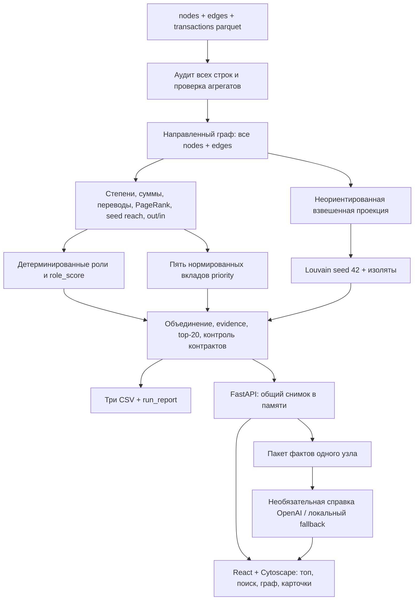

# Fusion: аудит готовности — 23 сентября 2026

Проверенная версия кода: `a81385a`, ветка `main`. Изучены исходный кейс, README датасета, текущий README, расчётные модули, API, интерфейс, все строки трёх parquet и существующие результаты. В этом этапе изменена документация; алгоритмы, интерфейс, входные данные и настройки провайдеров не менялись. Новых платных запросов не выполнялось.

## EXECUTIVE VERDICT

**READY WITH FIXES.** Расчётное ядро и обязательные CSV работают, воспроизводятся без LLM и укладываются в лимит пяти минут с большим запасом. Пересоздавать проект или переходить с React/FastAPI на Streamlit не требуется: исходное ТЗ допускает любой интерфейс.

Главный риск — разрыв между вычисленными основаниями и тем, что видит аналитик. В основном интерфейсе нельзя прочитать сумму конкретной связи; объяснение приоритета скрыто во всплывающей подсказке, а пять вкладов доступны только через данные/API. Поэтому красивый граф пока слабее отвечает на вопрос «почему проверять этого клиента первым», чем сам расчёт.

Методические ограничения: первое место чувствительно к PageRank; показатели активности коррелируют; штраф границы `0.5` — выбранная политика, а не доказанное снижение важности. Это причины честно показывать основания и ограничения, а не менять веса перед защитой без повторного анализа.

### Фактически выполненные проверки

| Проверка | Результат |
|---|---|
| Входные данные | **34/34**, прочитаны все строки и колонки; пропусков нет |
| Реальный CLI-запуск | **1,20 с** целиком; внутренний таймер **0,584 с** |
| Повторный расчёт | Те же байты всех трёх CSV |
| Существующие результаты / два новых расчёта / API | **3/3 файла побайтно совпали** |
| `nodes_roles.csv` | **2248 строк**, каждый исходный gid ровно один раз |
| `clusters.csv` | **88 строк**, все узлы распределены по кластерам |
| `top_nodes.csv` | **20 строк**, правильные ранги и порядок |
| Обязательные поля CSV | **0 пустых значений**; скоры конечные в [0,1], evidence непустое и ≤200 символов |
| Backend | **76/76 тестов**, 3,416 с |
| Frontend | TypeScript и production-сборка успешны |
| Зависимости | `pip check`: конфликтов нет |
| Сохранность parquet и starter | **6/6 SHA-256** совпали с исходным MANIFEST |
| Работающий экземпляр | Health и `/api/analysis` через Vite отвечают; Fusion виден в обычном Chrome пользователя |

Дополнительно распакован `git archive HEAD` в отдельную временную папку, скопированы только три parquet, создана новая venv, установлены зависимости из закреплённых файлов и выполнен `npm ci`. В копии нет `backend/.env`. Установка Python-зависимостей заняла 13,624 с, npm — 1,747 с, сборка — 4,447 с. Первый полный процесс pipeline в свежем окружении: **21,586 с**, внутренний таймер 3,968 с. Все три SHA-256 совпали с текущими результатами.

Это проверка новой копии и окружения на **том же ноутбуке**, с кешами пакетов: macOS 26.5.1 arm64, Python 3.12.14, Node 22.13.1, npm 10.9.2. Другая машина/ОС не проверена. Предупреждение Starlette об устаревающем тестовом клиенте httpx не помешало тестам; замену зависимостей перед демо не планируем.

Команды основной проверки из корня репозитория:

```bash
.venv/bin/python -m backend.pipeline --out artifacts/audit_repro_a
.venv/bin/python -m backend.pipeline --out artifacts/audit_repro_b
.venv/bin/python -m unittest discover -s backend/tests -v
.venv/bin/python -m pip check
npm --prefix frontend run build
.venv/bin/python scripts/run_local.py --check
```

Контрольные SHA-256:

```text
nodes_roles.csv  401fefad524f8963934ddff262d9c45edbfcabf1950e57ad71dc1d4b52bc8b08
clusters.csv     db7f6ccd1ae8a63dfc3fe6db5cf8e0de7a727108906add817ad46077e54649bb
top_nodes.csv    3b20b9330c3537ee566db472817f6f9c54a36ac4f091c51d2d5903c3c74412eb
```

## CURRENT PIPELINE

Фактический порядок отличается от упрощённой линейной схемы: приоритет рассчитывается до кластеризации и не использует cluster_id или ярлык роли.



`transactions` агрегируются для сверки сумм и числа операций с `edges`; сами графовые признаки используют проверенные агрегированные рёбра. Время пока не участвует в ролях/приоритете. API заново рассчитывает снимок при старте, а не читает старые CSV. После замены parquet нужен перезапуск backend.

## REQUIREMENTS STATUS

VERIFIED означает проверенную реализацию и результат, а не установленную истинность ролей клиентов. PARTIAL — работающая основа с конкретным пробелом. BROKEN среди проверенных компонентов не обнаружен.

| Requirement | Status | Problem | Action |
|---|---|---|---|
| 1. Data loading | VERIFIED | 2248 / 3119 / 4840, 81 seed; вход полон только в рамках выгрузки | KEEP: контроль схем, ссылок и агрегатов |
| 2. Graph construction | VERIFIED | 35 компонент с 19 изолятами; 16 компонент, если учитывать только узлы рёбер | KEEP: направленность и все исходные узлы |
| 3. Graph features | VERIFIED | Базовые признаки проверены: степени, потоки, n_tx, PageRank, out/in, seed reach, depth и cluster. Дополнительные betweenness/HITS в продукте MISSING, рассмотрены в аудите; исходное ТЗ их не требует | ADD: betweenness отдельно при запасе времени; HITS не добавлять в score |
| 4. Role engine | VERIFIED | Реализованные эвристики не откалиброваны по истинным ролям | KEEP: правила, precedence, оговорки; раскрыть чувствительность порога consolidator |
| 5. Priority engine | PARTIAL | Формула корректна, но признаки коррелируют; штраф границы спорен; вклады не видны в UI | FIX: показать слагаемые и множитель; формулу сейчас сохранить |
| 6. Clustering | VERIFIED | 88 кластеров; гипотеза шаблонная и не доказывает назначение сообщества | KEEP Louvain; ADD оборот и лидеров выбранного кластера в UI |
| 7. CSV outputs | VERIFIED | 2248 / 88 / 20, обязательные поля заполнены; файлы локальные и игнорируются Git | KEEP: передать три результата вместе с материалами сдачи или воспроизвести командой |
| 8. Evidence | VERIFIED | Правила и why числовые; нет эталонной разметки; AI может переинтерпретировать факты | KEEP детерминированные основания; сделать why видимым |
| 9. UI | PARTIAL | Суммы отдельных рёбер и список потоков MISSING; нет betweenness; приоритет объяснён слабо | FIX: входящие/исходящие связи с суммами, затем пять вкладов |
| 10. README | VERIFIED | Задача, запуск, стек, проверка, схема и масштабирование описаны; найдены устаревшие PLAN/METHODOLOGY | FIX документации выполнен в этом этапе; добавлена ссылка на аудит |
| 11. Reproducibility | VERIFIED | Повторные результаты и свежая копия с новой venv совпали; другая машина/ОС UNKNOWN | KEEP закреплённые зависимости, команду расчёта, хеши |

### Данные и ограничения

- Период: 1–31 июля 2026, 31 календарная дата, точность `date32[day]`.
- Сумма переводов **365 890 012,01 KZT**, минимальная операция 5000 KZT. Все 3119 направленных пар совпали с агрегацией транзакций; максимальная разница float — около `5.82e-11 KZT`.
- **97** повторных строк сохранены: уникального transaction_id нет, агрегаты включают эти операции.
- **19/19** изолированных seed сохранены; у **31** seed нет исходящих. Отсутствие связей не означает отсутствие активности вне выборки.
- **444/444** узла depth=4 с нулевым выходом не получили terminal. Их роль peripheral обозначает недостаток наблюдения, а не отсутствие значимости.
- У seed не применяются ratio-правила transit/consolidator; terminal seed тоже не назначается.
- Все 2248 gid превышают безопасный диапазон JavaScript Number: int64/Python int внутри расчёта, строки в JSON и UI.
- Эталонных ролей нет. Тесты проверяют consistency, reproducibility и отдельные виды robustness; accuracy и экономический эффект не измерены.

## ROLE ENGINE: RULE, FEATURES, THRESHOLDS, REAL EXAMPLES

`I/O` — количество разных плательщиков/получателей, `r=out_kzt/in_kzt`. Ratio-правила разрешены только для не-seed с положительным входом без self-loop. Для coordinator фактический порог **P95 = 0,0011418017780822694** по 1785 неизолированным узлам вне границы.

| Роль | Правило после исключения изолятов и границы | Число | Реальный gid и признаки |
|---|---|---:|---|
| coordinator | I≥3, O≥2, seed_reach≥2, PR≥P95 | 18 | `100000002224132100`: I/O=5/4, seed_reach=2, PR=0,00633845, score=0,705 |
| distributor | O≥10, если coordinator не сработал | 61 | `100000000331309100`: I/O=5/99, исходящих операций 126, выход 23 001 375 KZT, score=0,9 |
| transit | Ratio допустим, I>0, O>0, r∈[0,8;1,2] | 67 | `100000003635170100`: I/O=3/4, вход/выход 268 500 / 253 500, r=0,944134, score=0,780168 |
| consolidator | Ratio допустим, I≥3, r<0,8 | 95 | `100000004015047100`: I/O=9/1, вход/выход 919 104 / 69 195, r=0,075285, score=0,865884 |
| terminal | Не seed, без self-loop, I>0, O=0, depth<4; прежние правила не сработали | 1034 | `100000006755850100`: depth=2, I/O=1/0, вход 443 475,80 KZT, score=0,55 |
| peripheral | Изолят, обрезанная граница либо нет специального правила | 973 | `100000005382566100`: seed, I/O=7/1; ratio нельзя использовать для классификации, score=0,2, priority=0,616791 |

Порядок: **isolated → boundary → coordinator → distributor → transit → consolidator → terminal → no_rule**. В peripheral входят 19 изолятов, 444 граничных и 510 остальных. Дополнительные подходящие роли не сохраняются отдельными метками.

Обнаруженные пересечения: coordinator/distributor — 3, coordinator/transit — 2, coordinator/consolidator — 10, distributor/transit — 1, consolidator/terminal — 45. Они последовательно разрешаются первым правилом. Поэтому 45 узлов с нулевым выходом и несколькими плательщиками считаются consolidator, а не terminal: это документированное решение.

Роли и `rule_id` свежего пересчёта совпали с существующими CSV у **2248/2248** узлов. Правила имеют структурный смысл, но пороги 3 плательщика, 10 получателей и диапазон ±20% — выбранные эвристики. Абсолютный минимальный входящий оборот для consolidator отдельно не задан; для значимости сумм используется priority. Нельзя утверждать, что пороги оптимальны.

### Что означает role_score

| Роль/правило | Формула |
|---|---|
| isolated / boundary / no_rule | 0,10 / 0,15 / 0,20 |
| terminal | 0,55 |
| coordinator | 0,55 + 0,20×min(seed_reach/5,1) + 0,15×min(I/10,1) |
| distributor | 0,55 + 0,35×min(O/30,1) |
| transit | 0,60 + 0,25×max(0,1−abs(r−1)/0,2) |
| consolidator | 0,55 + 0,20×min(I/10,1) + 0,15×(1−r/0,8) |

Фактический диапазон 0,10–0,90. Это сила поддержки выбранного правила, **не вероятность**, не измеренная уверенность классификатора. Значения между разными ролями не калиброваны; высокий role_score не обязан означать высокий priority.

### Устойчивость ролей

| Изменение одного параметра | Узлов сменили роль |
|---|---:|
| P95 → P94 / P96 | 4 / 4 |
| Distributor ≥10 → ≥9 / ≥11 | 5 / 6 |
| Consolidator ≥3 → ≥2 / ≥4 | **161 / 53** |
| Transit [0,8;1,2] → [0,78;1,22] / [0,82;1,18] | 4 / 5 |

Пять экспериментов с независимым изменением каждой суммы ребра в пределах ±1% дали **0–3 смены роли**. Это ограниченная проверка устойчивости, не accuracy. Самый спорный из проверенных порогов — число плательщиков consolidator; до защиты его не подгонять под желаемое распределение.

## PRIORITY ENGINE: почему именно этот Top-20

`P=PageRank/max(PageRank)` после обнуления PageRank изолятов. Для остальных признаков `L(x)=log1p(x)/max(log1p(x))`; если максимум нулевой, вклад нулевой.

```text
base = 0.30×P + 0.20×L(in_kzt+out_kzt) + 0.25×L(seed_reach)
     + 0.15×L(counterparties) + 0.10×L(in_tx+out_tx)
priority_score = round(base × factor, 6)
factor: 0 для изолятов, 0.5 для обрезанной границы, 1 иначе
```

Роль, role_score и cluster_id не входят в формулу. Это соблюдает разделение ROLE/PRIORITY; отдельного bridge_score сейчас нет. Нормировка зависит от текущей выборки, поэтому score разных выгрузок напрямую не сравнивается. Расхождение восстановленной формулы с CSV меньше `0,0000005` из-за округления.

В таблице **уже взвешенные** слагаемые; factor=1 для всех четырёх примеров:

| Ранг / gid | PageRank | Оборот | Seed reach | Контрагенты | Переводы | Priority |
|---|---:|---:|---:|---:|---:|---:|
| #1 `100000002224132100` | 0,300000 | 0,195283 | 0,110529 | 0,061293 | 0,068434 | **0,735539** |
| #2 `100000003684369100` | 0,094986 | 0,192270 | 0,195773 | 0,140304 | 0,092358 | **0,715691** |
| #5 `100000004015047100` | 0,106821 | 0,162464 | 0,221057 | 0,072527 | 0,062220 | **0,625090** |
| #20 `100000008710791100` | 0,015733 | 0,183093 | 0,180264 | 0,103813 | 0,064305 | **0,547209** |

**Почему #1 выше #2:** преимущество PageRank `+0,205014` перекрывает отставание по seed reach, контрагентам и операциям; итоговый отрыв лишь **0,019848**. У #1 — 6 уникальных контрагентов, 2 достижимых seed и 35 операций; у #2 — 85, 6 и 125. Первый узел находится в сильно связанной группе из 5 узлов и 10 внутренних рёбер. Его PageRank может отражать взаимные связи, а не реальное руководство сетью. PageRank даёт **40,8%** его балла; без этого слагаемого он становится #73.

**Почему #5 выше #20:** преимущества PageRank `+0,091088` и seed reach `+0,040793` перекрывают меньшие оборот, число контрагентов и операций. Отрыв **0,077881**. #5 достижим от 8 seed, #20 — от 5. Роль consolidator сама по себе бонуса не даёт. Разрыв #20 с #21 — **0,001280**: границу списка нельзя трактовать как качественную границу риска.

| Компонент | Доля среднего балла Top-20 | Старых участников остаётся при исключении слагаемого |
|---|---:|---:|
| PageRank | 12,74% | 15/20 |
| Оборот | 29,17% | 18/20 |
| Seed reach | 29,50% | 12/20 |
| Контрагенты | 16,66% | 14/20 |
| Переводы | 11,93% | 17/20 |

Для десяти узлов крупнейшее слагаемое — оборот, для девяти — seed reach, для одного — PageRank. **Состав Top-20 сильнее всего зависит от seed reach; первое место — от PageRank.** При изменении одного веса на ±25% остаются 18–20 участников Top-20, но PageRank−25% или seed reach+25% меняет победителя на нынешнего #2.

Пять слагаемых нельзя называть независимыми свидетельствами. Корреляция Pearson нормированных контрагентов и операций **0,857**, оборота и операций **0,655**, оборота и контрагентов **0,604**. Вместе три признака активности дают 57,8% среднего балла Top-20. Нормировка максимумом чувствительна к экстремальным значениям: при гипотетическом увеличении максимума PR в 10 раз с фиксированными признаками остаются 15/20 прежних участников. Это эксперимент с нормировкой, не пересчёт изменённого графа.

**Штраф границы требует явного объяснения.** Он не меняет текущий Top-20, но узел `100000008175078100` понижается с #235 до #1777: 0,406146 → 0,203073. Неполнота данных сама по себе не доказывает низкую важность. Сейчас следует показывать base, factor и ограничение; отдельно пересматривать политику штрафа уже после демонстрации, с проверкой нового списка.

## Дополнительные признаки: что проверено, но не добавлено

- **Betweenness:** точный направленный невзвешенный расчёт занял **1,24 с**; топ-20 пересекается с текущим на 8/20. Два узла первой десятки посредничества сейчас имеют позиции #340 и #432. Это полезный дополнительный взгляд на связующие узлы. Сумма перевода не использовалась как расстояние. Приближение по 128 источникам заняло 0,070 с, но совпало с точным топом лишь на 14/20; для текущего размера точный расчёт достаточно дешёв. Рекомендация — отдельная метрика/список, без немедленного изменения priority.
- **HITS:** рассмотрен на взвешенном графе; 97,88% hub-score приходится на нынешнего #1, около 99,99% — на первые пять узлов. Включение усилит концентрацию, не даст ясного нового основания. Не добавлять сейчас.
- **Мосты:** 1691 мост в неориентированной проекции, только 257 не прилегают к листу. Простой счётчик преимущественно повторит степень; анализ отделяемых групп — дальнейшее развитие, с оговоркой о потерянном направлении.
- **Время:** у **327 узлов** есть и вход, и выход в одну дату; всего **615 таких узло-дней**. Это можно показать как «входящие и исходящие в один день». Данные имеют точность до дня: они не доказывают порядок событий внутри дня или перевод именно полученных денег. Анализ 1–2 дней возможен как отдельная эвристика, но не нужен до исправления основных экранов. Сейчас ни один временной сигнал не влияет на роль или priority.

## KEEP

- Python/Pandas/NetworkX, направленный граф, проверка агрегатов и точных ID: дают корректную основу выбора кандидатов.
- Формальные правила шести ролей и отдельный многокомпонентный priority: позволяют объяснять результат без модели.
- Louvain с фиксированными параметрами на структурной неориентированной проекции; направление сохраняется для потоков и ролей.
- FastAPI + React + Cytoscape, поиск, компактная карточка и отдельное окно AI. Перенос на Streamlit съест время без новой ценности.
- Полные CSV, запуск одной командой, локальный fallback, отключённая NVIDIA.

## FIX

1. **Потоки с суммами:** показать для выбранного gid входящие и исходящие пары, сумму KZT и n_tx. Данные уже есть в API, но `NetworkGraph.tsx` использует сумму только для толщины ребра; нет подписи/выбора ребра и отдельного списка. Не полагаться на максимум восемь связей AI-пакета. Для большого окружения явно показывать ограничение и доступ к остальным связям.
2. **Почему приоритет:** вывести `why` и пять вкладов обычным текстом/полосами, вместе с base и factor. Сейчас `why` спрятан в `title` строки топа; это недостаточно для телефона и клавиатуры. Не смешивать объяснение роли с объяснением позиции.
3. **Документация:** устаревшие PLAN/METHODOLOGY, где UI/AI названы будущими, исправлены в этом этапе. Результаты аудита связаны с README/PROGRESS.

## ADD

- Краткая сводка выбранного кластера: n_nodes, n_seed, внутренний оборот, top_gids и существующая hypothesis. Например, кластер 0: 278 узлов, 1 seed, **31 237 334,24 KZT** внутренних переводов. Сейчас оборот и top_gids в UI не показаны.
- Только после основного исправления: betweenness в карточке и отдельный список связующих узлов. Это улучшает поиск кандидатов, которых существующий Top-20 может не выделить.

## SIMPLIFY

Один основной сценарий: **Top-20 → выбранный gid → потоки → основания приоритета → ограничения → CSV**. AI открывается при необходимости, а не становится обязательным шагом. Точные значения и полный GID должны быть доступны без дополнительных API-вызовов к модели. Не увеличивать узкую карточку длинными списками: использовать раскрываемую широкую область потоков.

## DROP

Перед сдачей не делать GNN/обучение, подбор весов под желаемые gid, HITS в score, миграцию frontend, универсальный чат, NVIDIA, массовую обработку LLM, продакшен-инфраструктуру, полный перебор циклов и обогащение клиентов. Temporal analytics отложить до завершения основного пользовательского пути.

## PRIORITY BACKLOG

Оценки включают локальную проверку, но не являются гарантией. P0 ниже — пробелы основного сценария из текущего запроса; сами расчёты и CSV уже соответствуют обязательной части исходного ТЗ.

| Приоритет | Task | Reason | Estimated effort | Acceptance test |
|---|---|---|---|---|
| P0 | Входящие/исходящие связи с суммами и n_tx | Без этого нельзя проверить денежную связь в основном UI | 15–20 мин | У gid `100000003635170100` видны 3 входящих и 4 исходящих контрагента; суммы сходятся с 268 500 / 253 500 KZT; UI работает без AI |
| P0 | Видимые пять вкладов priority + factor + why | Отвечает на главный вопрос продукта | 10–15 мин | Для #1 и #2 сумма вкладов×factor сходится со score в пределах 1e-6; доступно мышью и клавиатурой; карточка не растягивается от длинного текста |
| P0 | Финальный прогон пользовательского пути и три CSV для сдачи | Исключает потерю результата при упаковке | 10 мин | Команда README создаёт 2248/88/20 строк; поиск случайного gid, boundary и isolated; три скачивания; без ключей core доступен |
| P1 | Сводка кластера: оборот и лидеры | Превращает ID кластера в понятную группу | 5–10 мин | Кластер 0 показывает 278/1/31 237 334,24 и корректные top_gids, совпадает с CSV |
| P1 | Репетиция #5 → #1/#2 → boundary | Показывает полезность и ограничения, а не только красивый граф | 5–10 мин | За 3 минуты объясняются роль, положение в списке и неполнота данных; есть резерв без AI |
| P1 | Точная betweenness отдельно от текущего score | Даёт другой способ искать связующих участников | 20–30 мин, только после P0 | Метрика проверена на цепочке/развилке/изоляте, видна в карточке; отдельный топ; прежние role/priority не меняются; pipeline <5 мин |
| P2 | Пересмотр штрафа границы и нормировки | Полнота наблюдения смешана с важностью, оценки зависят от максимума | 30–45 мин после сдачи | Сравнение списков до/после; политика согласована и документирована; нет тихой смены score |
| P2 | Один дневной temporal-сигнал | Добавляет контекст проверки, без доказательства трассировки денег | 20–30 мин после P0 | Значения сверены с transactions; подпись не утверждает порядок внутри дня или тождество средств |
| P3 | Streamlit rewrite, GNN, HITS в score, NVIDIA, общий copilot | Риск и затраты выше пользы до дедлайна | Не планировать | В текущую сдачу не включены |

## NEXT ACTIONS

1. В существующем UI добавить раскрываемую таблицу потоков выбранного gid с направлением, контрагентом, суммой и числом операций. Проверить совпадение итогов с карточкой и полноту при лимите графа.
2. Рядом с priority добавить видимые слагаемые, множитель полноты и why. Сохранить текущие веса и все результаты, проверить #1/#2 и boundary.
3. Повторить затронутые проверки, скачать три CSV и пройти трёхминутное демо на #5, сравнении #1/#2 и depth=4. После этого заморозить core; кластерную сводку и betweenness делать только при оставшемся времени.

## FINAL DECISION

- **DO NOW:** закончить аудит и актуализировать документы — выполнено; следующая реализация — потоки с суммами и видимое объяснение priority.
- **DO NEXT:** финальная проверка, три выгрузки, репетиция; затем компактная сводка кластера, если есть запас.
- **DO NOT TOUCH:** рабочая архитектура, parquet/starter, детерминированные правила, текущие веса, Louvain, точность ID, fallback.
- **BEST OPTIONAL FEATURE:** отдельный список связующих узлов по точной betweenness, с показателем в карточке, без добавления в общий score.
- **DROP:** новые AI-сценарии, NVIDIA, ML-тюнинг и миграция стека.
- **SUBMISSION READINESS: READY WITH FIXES.** После двух P0-исправлений интерфейса и финального прогона — **READY — FREEZE CORE**. Исправления UI в этом аудите не выдаются за выполненные.
